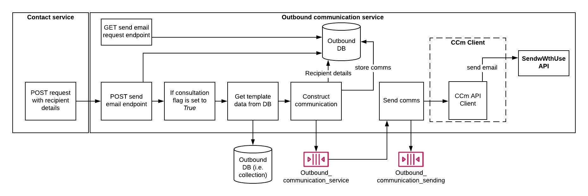

# DHT_OutboundCommunications
This service deals with sending outbound communications to customers.

A full Restful CRUD API for managing outboundcommunications written in Node.js, Express and MongoDB.



## Steps to setup the service

**Install dependencies**

```bash
npm install
```
**Run Server**

```bash
node server.js
```

**Run the service using make**

```bash
make run-all
```

## Run the outboundcommunication API
**You can browse the api at:** <http://localhost:5000>

Here are the following API endpoints:

1.	Create a new outboundcommunication: **POST** http://localhost:5000/outboundcommunications
2.	Retrieve all outboundcommunications: **GET** http://localhost:5000/outboundcommunications
3.	Retrieve a single outboundcommunication with outboundcommunicationId: **GET** http://localhost:5000/outboundcommunications/{outboundcommunicationId}
4. Update a OutboundCommunication with outboundcommunicationId: **PUT** http://localhost:5000/outboundcommunications/{outboundcommunicationId}
5. Delete a OutboundCommunication with outboundcommunicationId: **DELETE** http://localhost:5000/outboundcommunications/{outboundcommunicationId}

## Run unit tests

